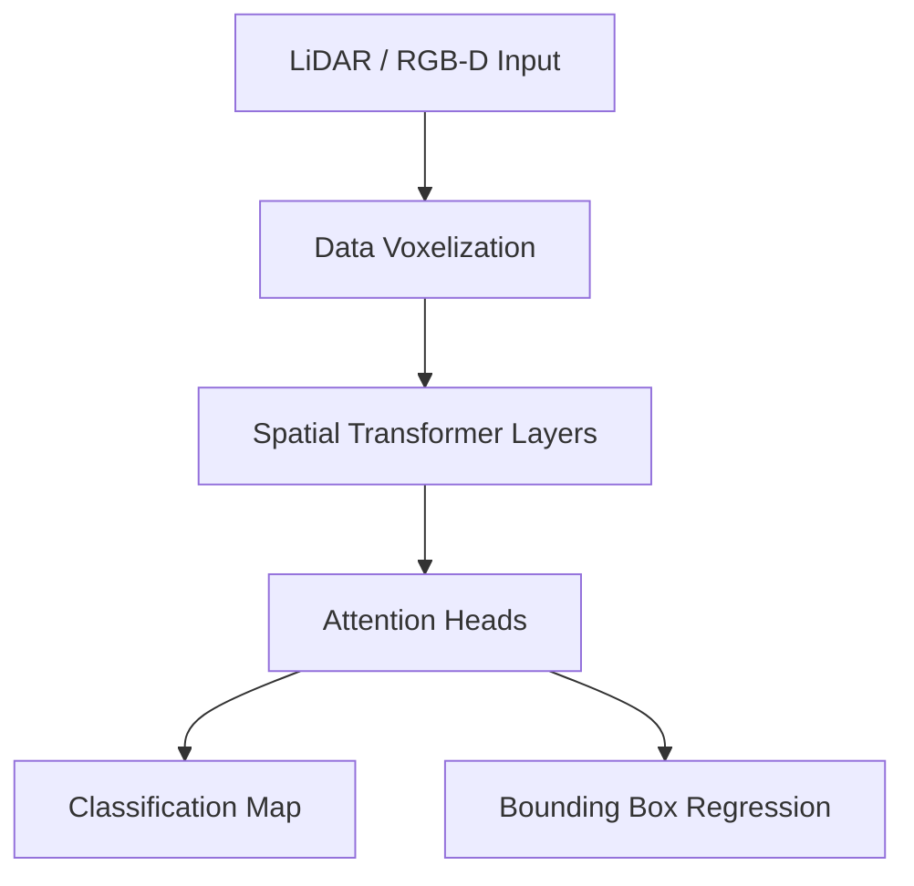

# 3D Spatial Transformer Model (PyTorch)


## 📖 Overview
This repository houses a **3D Spatial Transformer Model** implementation in PyTorch. It provides a deep learning environment designed for 3D spatial reasoning, significantly enhancing an AI's spatial awareness, 3D object detection, and manipulation capabilities for use in autonomous robotics and spatial computing.

## ✨ Key Features
- **Point Cloud Processing:** Direct ingestion and augmentation of LiDAR/Depth-camera point clouds.
- **3D Bounding Box Regression:** Accurately plots object spatial coordinates and orientation in 3D space.
- **Spatial Attention Mechanisms:** Focuses neural paths on complex topologies rather than empty space.
- **PyTorch 3D Integration:** Leverages cutting-edge PyTorch 3D libraries for rapid dataset batching and geometric transformations.

## 🏗 System Architecture


## 📂 Repository Structure
- `ai_engine/`: Model definitions, `spatial_attention.py`, and `pointnet.py` wrappers.
- `backend/`: Inference APIs taking raw point cloud bytes and returning JSON coordinates.
- `infra/`: GPU-enabled container manifests.

## 🚀 Getting Started

### Local Development
1. Clone the repository and install dependencies (requires CUDA for GPU training):
   ```bash
   pip install -r requirements.txt
   ```
2. Start the inference API:
   ```bash
   uvicorn backend.main:app --host 0.0.0.0 --port 8000
   ```

## 🛠 Known Issues
- Optimize PyTorch memory footprint for edge devices.

## 🤝 Contributing
PRs focusing on tensor optimization and integration with new depth-sensor hardware are heavily appreciated.

## ?? Future Roadmap & Enhancements
- **Dynamic Obstacle Trajectory Prediction**
- **Shift data preprocessing of Point Clouds to C++ CUDA kernels**
